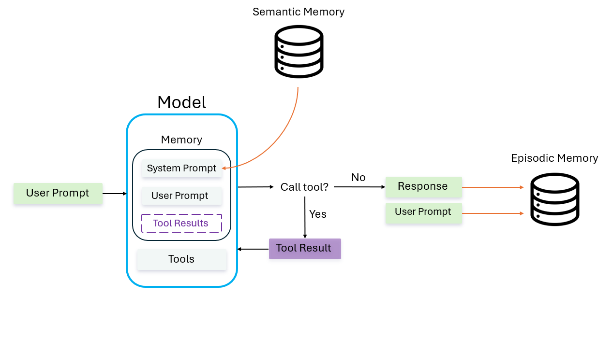

# Claude API RAG System with SQLite

## A proof-of-concept chatbot built with the raw Claude Messages API that implements a RAG system on chat history (episodic memory) and persistent facts (semantic memory) using SQLite

**This project was not associated with any BP process and was built on the side**

### Intro
This project is an educational and instructive learning exercise for a memory system in an agent harness. It wraps the raw Claude Messages API in a manual tool-calling loop, giving the model two memory tools: a semantic search over past conversation turns stored as embeddings in a SQLite vector store (episodic memory), and a table of durable facts explicitly stored about the user (semantic memory). Each conversation turn is embedded and saved so later turns can recall relevant past exchanges by similarity and keywords instead of keeping the full history in context. The goal is to test raw LLM tool definition and calling using explicit tool schemas to route between storing durable facts and searching episodic history, and vectorization in semantic querying without relying on a higher abstraction orchestration framework as solutions for limited context windows. The flow is as follows:

1. The user sends their first message.
2. Chat is initialized, with all durable facts from permanent memory loaded into the system prompt.
3. The model decides whether the user is referencing a past chat or stating a new durable fact, and calling the correct tool if so.
    - Every chat that doesn't invoke the episodic memory tool calls the semantic memory tool so that any relevant facts get loaded in.
4. If no memory tool needs to be called, the model sends its response. If a memory tool is needed, the following loop initiates:
    - The model requests to run the tool
    - The function is ran
    - Tool result is sent back as a new message
    - The API is called once again with the tool result

    The model may once again decide a tool call is needed, continuing the loop

### Tool Loop Diagram:



## Setup

1. Have Claude Code
2. Create config/.env and set your API key (.env.example is a reference of what it should look like)
3. Install dependencies:
    ```
    pip install anthropic python-dotenv sentence-transformers sqlite-vec
    ```
4. Run with:
    ```
    python main.py
    ```

## Episodic Memory

This is a running log of every individual exchange between the user and the LLM. An exchange is defined to be one user message and the LLM's response. Episodic memory is searched semantically and by keywords, creating a hybrid query. When creating Episodic Memory, you have two choices. You can save whole conversations and add a summary field, or save individual or chunks of exchanges. I found the latter to be more efficient as we don't *have* to inject a full conversation when we don't need it. Transparently, the downside is that you may not get the full context in a long conversation, but there are measures implemented to minimize that risk.

**Fix 1: Adjacent exchange merging**
- If results are within a predetermined adjacency window ($\pm$ 2) Those exchanges get merged into one result from the semantic query. Thus, our `top_k` has more space for relevant exchanges.
    - E.g. exchanges 1,2 or 1,3, or even 1, 3, 5 get merged.
- Since most topics with lots of context come from constant back and forth messages, This should cover *most* of what needs to be pulled
- A concern arises about long chains, but it shouldn't be a problem as each result from the semantic/keyword queries passed a score threshold.

**Fix 2: Generous `top_k`**
- `top_k` is set to 8, meaning after the hybrid search we can inject up to 8 exchanges. This is conjunction with **Fix 1** should allow for most context from a conversation to enter.
- There is once again a worry about 8 being too large, and too much context entering, but this is once again safeguarded by the score threshold.

## Semantic Memory

I draw the disticntion between "Permanent" Memory and Semantically Searched Memory to highlight the nuanced definition. Semantic Memory is not exclusively memory that is searched semantically, rather it adopts the definition from Psychology principles: "long-term, conscious memory that stores general knowledge, facts, concepts, and word meanings."

### "Permanent" Memory

This is memory that is injected into the system prompt at the beginning of every session. We have two different stores of permanent memory, user facts and lessons. The split is just to ensure the LLM can clearly digest it. The `perm_mem_schema` and `lesson_schema` tools give the chatbot the capability to store permanent memories.

### *Semantically Searched* Memory

This is Semantic Memory that we *actually* search semantically. After every user prompt, the `search_semantic_mem` tool instructs the LLM to search semantic memory for relevant context that could be used for to answer the prompt.

Since semantic memory is pulled every chat, there is a dedup mechanism in place that keeps track of all chunks currently in context and doesn't allow any duplicates to enter. 

(Chunking is not currently implemented)

(Episodic promotion is not yet implemented)

## Claude Messages API

- The Claude Messages API is stateless, meaning it executes one isolated response on its current context, and thus we must manage the context window ourselves. We do this by maintaining a `messages` list of dicts. Every user message, model response, and tool message are appended to this list as the conversation goes on, and that list is injected as the prompt for every API call. 

- We define multiple tool schemas prior to the model invokation in JSON schema format. The tools' descriptions are what the model references to decide what tool to use and when. 
    - Tool List:
        - `episodic_schema`: Recall episodic memories
        - `perm_mem_schema`: Add user facts to permanent memory
        - `lesson_schema`: Add lessons to a different permanent memory store 
        - `add_semantic_mem`: Add a semantic memory (User initiated)
        - `search_semantic_mem`: Search semantic memories (Run on every exchange)
    - Part of the complexity is handling the tool loop manually. Claude provides a tool (Agent SDK) that abstracts the tool loop, state management, and stop reasons. This project intentionally skips that abstraction to work at the lower level, trading convenience for a deeper study of how each step (tool requests, dispatch, results, state) actually works.

## SQLite

- Why SQLite
    - SQLite was chosen as the database since it is free, local, and lightweight.
    - Since SQLite is file-based, the entire memory store is a single `.db` file with no server or setup step, which fits the project's scope as a local proof of concept rather than a production data layer.

- Querying
    - The `sqlite-vec` extension adds vector similarity search directly to SQLite through a virtual table (`vec0`), so embeddings can be stored and queried without standing up a separate vector database.
        - We use cosine as the distance metric to be able to intuitively understand whether a score is good or bad.
        - The threshold for returned chats is hardcoded at .75, but there is no right answer. The threshold at .75-.9 is what i found works best for me.
    - The `FTS5` built in extension provides the functionality for keyword searching, using `BM25` for relevance scoring.
    - Seven tables support the two memory types: `exchanges` stores the raw text of each conversation turn (one user prompt and one model response); `vec` is the virtual table that stores embeddings for those turns (linked to `exchanges` by id) and is used for episodic search; `chunks` is the semantic memory table, searched on every exchange, that splits long memories into smaller chunks (not yet implemented); and `sem_vecs` is the virtual table that stores embeddings for semantic search. Then, `perm_memory` and `lessons` hold the durable facts automatically loaded into every session, `keywords` is the virtual table that indexes each turn's raw text for literal keyword matching 

### Hybrid Querying and RRF
- Running a hybrid style query is beneficial for context retrieval since a 384D semantic search is far from perfect. A keyword search helps plug the holes.
- With hybrid querying, we need a way of combining the results since each search is ran individually. Reciprocal Rank Fusion, or RRF, is the algorithm commonly used to combine the results of a hybrid query for LLM context management. 
- RRF can't combine the two results by their raw scores directly, since cosine distance and BM25 rank live on incomparable scales. Instead it only looks at each result's *rank* (its position) within its own list:
    - `RRF_score(d) = Σ 1 / (k + rank(d))`, summed over every ranked list `d` shows up in (rank is 1-indexed; a doc missing from a list just contributes nothing for that list). Higher score wins, since a better (lower) rank produces a larger fraction, opposite polarity from distance, where lower is better.
    - `k` is a damping constant (60 here, the standard default from the original 2009 RRF paper) that controls how much a rank difference matters. A small `k` makes rank 1 vs rank 2 a huge gap, a large `k` makes the top ranks nearly indistinguishable, which is more forgiving of noisy small differences.
- `semantic_search` and `keyword_search` both return up to `top_k` results. After RRF scoring, adjacent or near adjacent exchanges (determined by $\pm$ 2 their `turn_index`, the ${n}^{th}$ exchange in the conversation) are merged into single entries. This allows for larger conversations to be pulled in.
- Performance is determined on the balancing of: `top_k` ceilings, `max_distance` (semantic threshold), and the adjacency windows for merging.

### Embedding Model

- Embeddings are generated locally with `sentence-transformers`' `all-MiniLM-L6-v2` model rather than an embedding API call, keeping the project self-contained and avoiding extra latency/cost on every turn.
- The model outputs 384-dimensional vectors, matching the `float[384]` column defined on the `vec0` virtual table.
- The same model is used both to embed each conversation turn when it's stored (`add_chat`) and to embed the query text at recall time (`semantic_search`), which is required since a query is only comparable to stored vectors that came from the same embedding
space.

## Problems Encountered and Fixed
1. Memory search results primarily returning memory recall turns.
    - **The Problem:** If a user were to ask a question about memory that didn't exist yet, the model would (correctly) state that the memory didn't exist. However, after that memory is instilled, if the user were to ask once again, the top result would be the exchange where the user asked the question, and the model responded saying it had no memory. Thus the model "not having the memory" would propogate.
        - Even if the results were the memory recall turns where the model correctly pulled memory, the response itself is a summary, and each subsequent recall of that topic would degrade as it summarizes a summary, which itself could have summarized a summary and so on.
    - **The Fix:** Don't store episodic memories of memory recall exchanges, creating a win-win where the memory is injected into context but not saved as an event since it's a meta exchange on previous information.

2. Model treated the system prompt injected permanent facts as it's only source of memory.
    - **The Problem:** The model wouldn't invoke the memory tool because it thought it had all relevant memory already coming in through the system prompt. The permanent facts were preceded with "Permanant facts:" which could have caused this incorrect thinking. This would also cause a meta exchange to be saved to the database, side-stepping the fix to problem 1.
    - **The Fix:** The preceding prompt was tweaked to "Durable facts you've been told to remember (doesn't replace searching for memory):"

3. Unrelated semantic results bled into context, and if that topic was requested to be recalled, the model treated that as the full context for that topic.
    - **The Problem:** If we asked to recall topic X and a small bit of topic Y bled through the semantic results, the model would never re-query to retrieve the full context for topic Y.
    - **The Fix:** Add to the memory tool description saying "Call this for every NEW topic about the past, even if you have some info on it."

4. Semantic memories were entering the context multiple times.
    - **The Problem:** Since the semantic search runs on every chat, if we kept the conversation focused on one topic, the same semantic memories would resurface as relevant and enter the context.
    - **The Fix:** Add `AND id NOT IN` to the semantic query to make sure we are getting something that is not already in context. To make this work, a set `seen_chunk_ids` is instantiated at the beginning of every chat that keeps getting updated with each semantic chunk we pull in.

5. Episodic Memory and Semantic Memory being used for one chat.
    - **The Problem:** Since Episodic memory promotion has not yet been implemented, certain topics will live in both memory stores, and thus, pull in redundant context.
    - **The Fix:** Only pull from Semantic Memory if Episodic Memory is not being recalled. Good practice regardless since in those scenarios we do not necessarily need anything from Semantic Memory, and will prevent an unrelated chunk that barely passed our threshold from entering the context.

## Still to implement

- Cost / usage tracking
- Episodic memory promotion
- UI
- Redundant id in perm mem
- Caching
- Compaction
- "pull more" if context pulled from episodic is not enough. documen in episodic mem fixes.
- tool names